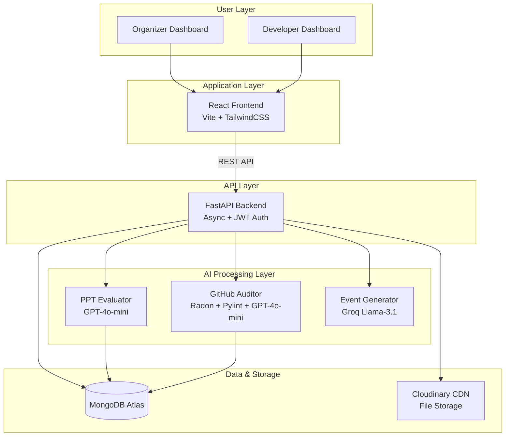
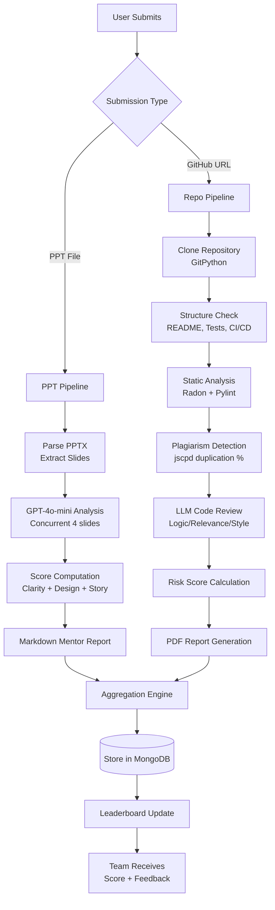
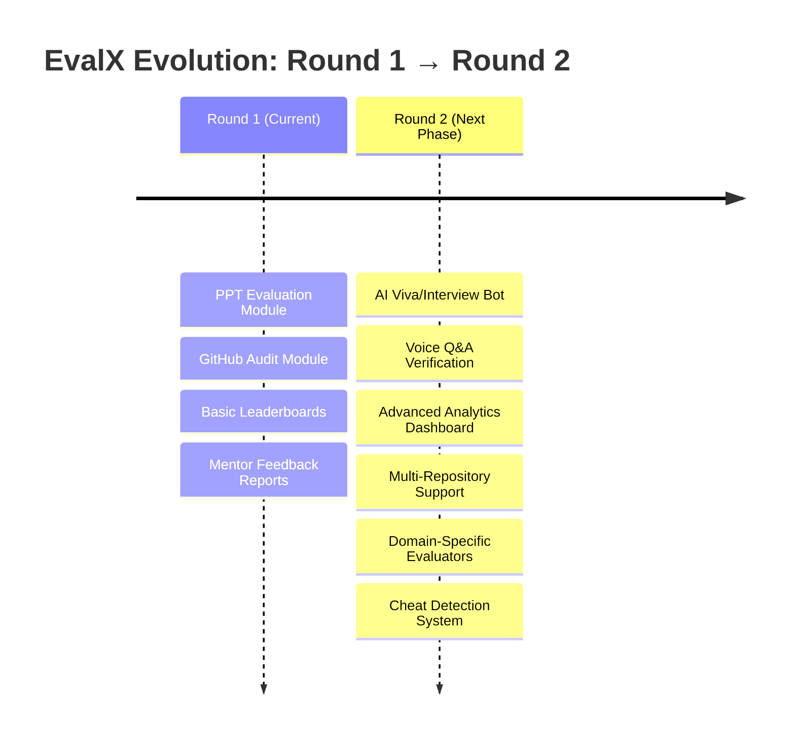

# 🏆 EvalX: AI-Powered Hackathon Evaluator

**Turning subjective judging into objective data in <60 seconds.**

EvalX uses AI to evaluate both **Presentation Quality** (PPT) and **Code Quality** (GitHub) simultaneously - providing ranked leaderboards and actionable mentor feedback.

🔗 **Live Frontend**: https://eval-x.vercel.app/


---

## 🚨 The Problem

**Hackathons are broken. Judges are exhausted, bias creeps in, and flashy UIs win over solid code.**

### Pain Points in Traditional Evaluation:
- **50+ submissions, 10 judges, 12-hour evaluation window**  -  Impossible to maintain quality
- **Code quality ignored**  -  Judges focus on demos and presentations, not the actual implementation
- **Inconsistent scoring**  -  Different judges have different standards and biases
- **Zero actionable feedback**  -  Participants get a score but no guidance on improvement

**The Reality**: *12 hours of judging compressed into 3 minutes per team = rushed decisions and missed talent.*

---

## 💡 The Solution: EvalX

**A multi-modal AI evaluator that scores Presentations AND Code in parallel, eliminating bias and accelerating judging by 10x.**

### Core Modules

#### 1️⃣ PPT Evaluator
Analyzes presentation slides to understand how well teams communicate their ideas.

**What it evaluates:**
- **Clarity**: Is the message clear? Are headings present? Is text readable or overwhelming?
- **Design**: Do the slides have good alignment, contrast, and visual hierarchy?
- **Storytelling**: Does the presentation define the problem, explain the solution, and have logical flow?

**How it works:**
- Extracts all slides from uploaded PowerPoint files
- Uses GPT-4o-mini to analyze each slide concurrently (processes 4 slides at once)
- Computes scores based on clarity, design quality, and narrative strength
- Generates a detailed Markdown mentor report with slide-by-slide feedback

**Scoring Logic:**
```
Clarity Score = (headline_present + key_message_present + text_density + readability) / 4 × 100
Design Score = (alignment + contrast + visual_hierarchy) / 3 × 100  
Story Score = (problem_defined + solution_defined + use_case_clear + logical_flow) / 4 × 100
Overall PPT Score = (Clarity + Design + Story) / 3
```

#### 2️⃣ GitHub Auditor
Performs deep technical analysis of code repositories to evaluate implementation quality.

**What it evaluates:**
- **Structure**: Does the repo have README, tests, proper configuration files, CI/CD?
- **Code Complexity**: Are functions too complex? (measured using cyclomatic complexity)
- **Code Quality**: Does the code follow best practices? (measured using Pylint scoring)
- **Plagiarism**: How much code is duplicated or copied?
- **Logic & Relevance**: Does the code actually solve the stated problem? Is it well-written?

**Multi-Phase Pipeline:**

**Phase 1: Repository Cloning**
- Downloads the GitHub repository to analyze its contents

**Phase 2: Structure Check**
- Looks for README.md, requirements files, test folders, Dockerfile, GitHub Actions
- Counts files and directories to understand project size

**Phase 3: Static Analysis**
- **Radon**: Calculates cyclomatic complexity (measures how complicated functions are)
- **Pylint**: Scores code quality on a 0-10 scale based on Python best practices

**Phase 4: Plagiarism Detection**
- **jscpd**: Copy-Paste Detector that finds duplicate code across files
- Returns percentage of code that's copied or repeated

**Phase 5: Code Smell Detection**
- **High Complexity**: Functions with complexity score ≥ 10 (very hard to maintain)
- **Missing Tests**: No test folder found (risky for production)
- **Low Quality**: Pylint score below 5.0 (poor coding standards)
- **High Duplication**: More than 25% plagiarized code

**Phase 6: Risk Score Calculation**
Combines all metrics to determine how risky the codebase is:
```
Risk Score = plagiarism × 0.4 
           + (10 - pylint_score) × 3.0
           + code_smell_count × 4.0
           + (no_tests ? 15 : 0)
           + (no_readme ? 5 : 0)
# Clamped to 0-100 scale
```

**Phase 7: AI Code Review**
- GPT-4o-mini reads code chunks (up to 8 segments of 300 lines each)
- Evaluates three dimensions:
  - **Logic Score**: Is the code logically sound and efficient?
  - **Relevance Score**: Does the code match the project description?
  - **Style Score**: Is the code clean, readable, and well-structured?

**Phase 8: Final Scoring**
```
Final Score = (100 - plagiarism) × 0.3 
            + logic × 0.25 
            + relevance × 0.2 
            + style × 0.15 
            + (pylint × 10) × 0.05 
            + structure × 0.05
```

**Phase 9: Comprehensive Report Generation**
- Markdown mentor report with strengths, weaknesses, and specific improvement suggestions
- PDF technical report with all metrics
- AI-generated rewrite suggestions for problematic code sections
- Grade assignment (A+ to D) based on final score

#### 3️⃣ Unified Dashboard
**For Organizers:**
- Create events with AI assistance (auto-generate descriptions)
- View all team submissions in one place
- Access real-time leaderboards (per-round and overall)
- Download evaluation reports

**For Developers/Participants:**
- Browse and join hackathon events
- Create or join teams
- Submit presentations and GitHub repositories
- Receive instant AI evaluation with detailed feedback
- Track team ranking on leaderboard

### Key Differentiator

**We don't just score - we mentor.**

Every evaluation includes specific, actionable recommendations for improvement. Teams don't just get a number; they understand *why* they got that score and *how* to improve.

---

## ⚙️ System Architecture


*High-level system architecture showing data flow between components*



**Architecture Highlights:**
- **Async Processing**: Backend uses Python's async/await to handle multiple evaluations concurrently
- **Parallel AI Calls**: Multiple slides or code chunks analyzed simultaneously
- **Scalable Storage**: MongoDB for structured data, Cloudinary CDN for file hosting
- **JWT Authentication**: Secure, stateless authentication with role-based access control

---

## 🧠 How It Works: The Evaluation Logic



### Detailed Flow Explanation

#### PPT Evaluation Flow:
1. **Upload**: Team uploads PowerPoint file
2. **Extraction**: System parses the PPTX file and extracts all slides with text and images
3. **Concurrent Analysis**: Four slides are analyzed simultaneously by GPT-4o-mini for speed
4. **Scoring**: Each slide gets three scores (clarity, design, storytelling) which are averaged
5. **Report Generation**: AI creates a slide-by-slide mentor report in Markdown format
6. **Storage**: Results stored in database, team notified instantly

#### GitHub Evaluation Flow:
1. **Submission**: Team provides GitHub repository URL
2. **Cloning**: System clones the repository to a temporary directory
3. **Structure Analysis**: Checks for essential files (README, tests, config files)
4. **Static Analysis**: Runs **Radon** (complexity) and **Pylint** (quality) on all code files
5. **Plagiarism Check**: Scans for duplicate code using **jscpd**
6. **AI Review**: **GPT-4o-mini** reads code and scores logic, relevance, and style
7. **Risk Assessment**: Combines all metrics to calculate a risk score
8. **Report Generation**: Creates both Markdown mentor summary and PDF technical report
9. **Storage**: Complete evaluation saved to database, leaderboard updated

**Typical Processing Time:**
- PPT Evaluation: **~30-60 seconds**
- GitHub Evaluation: **~60-90 seconds**

---

## 🚀 Prototype Demo: What's Working RIGHT NOW


*EvalX Landing Page - AI-Powered Hackathon Evaluation & Mentoring Platform*

### Fully Functional Features:

✅ **User Authentication System**
- Secure signup and login with JWT tokens
- Role-based access control (Organizer vs Developer)
- Password hashing with BCrypt

✅ **Event Creation & Management**
- Create multi-round hackathon events
- AI-assisted event description generation (powered by Groq Llama-3.1)
- Upload event banners and logos to Cloudinary
- Configure team limits, member limits, prize pools

✅ **Team Management System**
- Create teams within events
- Send join requests to teams
- Accept/reject team member requests
- Team leader controls and member management

✅ **PPT Submission & Evaluation**
- Upload PowerPoint files
- Receive AI evaluation in under 60 seconds
- View overall score and per-slide breakdown
- Read detailed mentor feedback with improvement suggestions

✅ **GitHub Repository Submission & Evaluation**
- Submit GitHub repository URL and demo video
- Multi-phase analysis with 9 evaluation phases
- Receive comprehensive scoring (Logic, Relevance, Style, Plagiarism, Quality)
- View AI-generated mentor report and rewrite suggestions
- Grade assignment (A+ to D) based on final score

✅ **Real-Time Leaderboards**
- Per-round rankings (separate for PPT, GitHub, etc.)
- Overall combined leaderboard
- Live score updates as teams submit

✅ **Submission Tracking Dashboard**
- View all team submissions in one place
- Track submission status (pending, processing, completed)
- Access evaluation reports and feedback

✅ **Responsive UI with Smooth UX**
- Built with React 19 and TailwindCSS
- Framer Motion animations
- Mobile-responsive design
- Role-based dashboard views

---

## 🔮 Round 2 Enhancements: The Roadmap



### Planned Upgrades for Round 2

#### 🎤 Feature 1: AI Viva/Interview Module (The Verification Layer)

**Purpose**: Test conceptual depth and verify authorship for top 10 finalist teams.

**The Problem It Solves**: 
Automated evaluation can't detect if someone copied code without understanding it. The Viva module ensures teams actually understand their own work.

**How It Works:**
1. **Project Upload**: Team uploads project documentation PDF
2. **Question Generation**: AI analyzes the PDF and generates 5 contextual, technical questions
3. **Real-Time Interview**: Team member answers questions via voice
4. **Transcription**: Whisper (Speech-to-Text) converts audio to text
5. **Evaluation**: GPT-4o-mini scores each answer (0-10) based on:
   - Technical correctness
   - Clarity of explanation
   - Depth of understanding
   - Relevance to the project
6. **Summary Report**: Final interview performance summary with strengths and gaps

**Integration Flow:**
```
Round 1: PPT Evaluation (All teams)
    ↓
Round 2: GitHub Evaluation (Qualified teams)
    ↓
Round 3: AI Viva Interview (Top 10 finalists only)
```

**Technical Status**: 70% backend implementation complete (routes and logic exist in `backend/routes/interview.py`). Needs frontend integration and production optimization.

**Use Case**: Imagine a team submits a perfect GitHub repo with clean code. The Viva asks: *"Explain how your authentication middleware works."* If they can't answer, it reveals potential plagiarism or lack of understanding.

---

#### 📊 Feature 2: Advanced Analytics Dashboard

**For Organizers:**
- **Judge Calibration Metrics**: Track consistency across different AI evaluation runs
- **Theme-Wise Analysis**: Compare performance across Web3, IoT, AI/ML themes
- **Historical Trends**: See which types of projects score higher over multiple events
- **Submission Patterns**: Heatmaps showing when teams submit (early vs last-minute)
- **CSV Export**: Download all evaluation data for offline analysis

**For Participants:**
- **Skill Radar Chart**: Visual representation of strengths (Design, Code Quality, Logic, etc.)
- **Peer Comparison**: See how your scores compare to team averages
- **Progress Tracking**: Track improvement across multiple hackathons

---

#### 🏗️ Feature 3: Scalability Upgrades

**Current Limitation**: Processing is synchronous. If 100 teams submit at once, later submissions wait.

**Solution:**
- **Microservices Architecture**: Split PPT evaluator and GitHub auditor into separate services
- **Redis Queue System**: Queue submissions and process them with worker pools
- **WebSocket Real-Time Updates**: Send live progress notifications ("Your repo is being cloned...", "Running static analysis...")
- **Caching Layer**: Cache evaluation results for re-submissions (if repo hasn't changed)

**Impact**: Handle 1000+ concurrent submissions without performance degradation.

---

#### 🔒 Feature 4: Cheat Detection System

**Cross-Submission Plagiarism**:
- Compare all submitted code repositories within the same event
- Flag teams with >60% similar code

**StackOverflow Snippet Detection**:
- Integrate CodeSearchNet dataset
- Identify commonly copied code patterns from tutorials

**GitHub Commit Verification**:
- Analyze commit timestamps (did 90% of code appear in the last hour?)
- Check commit messages for patterns (meaningful vs generic)
- Flag repositories with suspicious commit patterns

**Collaboration Detection**:
- Identify multiple teams submitting nearly identical code
- Generate similarity reports for manual judge review

---

#### 🎯 Feature 5: Domain-Specific Evaluators

Different hackathon themes need different evaluation criteria. We'll add specialized analyzers:

**Web3/Blockchain Projects:**
- Smart contract security auditing using Slither
- Gas optimization analysis
- Solidity best practices checker

**IoT & Automation Projects:**
- Hardware-software integration validation
- Power consumption analysis (from code patterns)
- Real-time performance testing

**Fintech Projects:**
- OWASP security vulnerability scanning
- PCI-DSS compliance checks
- Transaction logic verification

**AR/VR Projects:**
- Performance profiling (frame rate analysis from code)
- Memory usage patterns
- Rendering optimization checks

**AI/ML Projects:**
- Model architecture evaluation
- Training data handling assessment
- Inference performance estimation

---

### Why These Enhancements?

**The Viva Module** closes the "authenticity gap" in automated evaluation. It's the human touch that AI evaluation needs.

**Analytics Dashboard** provides organizer value beyond just judging - it becomes an insights platform.

**Scalability Upgrades** ensure EvalX can handle real-world hackathon loads (100+ teams).

**Cheat Detection** maintains competition integrity and fairness.

**Domain Evaluators** make EvalX the go-to platform for specialized hackathons, not just generic ones.

---

## 🛠️ Tech Stack

### Frontend
| Technology | Purpose |
|------------|---------|
| **React 19** | UI framework with latest features |
| **Vite** | Fast build tool and dev server |
| **TailwindCSS** | Utility-first CSS framework |
| **Framer Motion** | Smooth animations and transitions |
| **Axios** | HTTP client for API calls |
| **React Router** | Client-side routing |
| **React Markdown** | Render AI-generated feedback |

### Backend
| Technology | Purpose |
|------------|---------|
| **FastAPI** | Async Python web framework |
| **Motor** | MongoDB async driver |
| **PyJWT** | JSON Web Token authentication |
| **BCrypt** | Password hashing |
| **python-pptx** | PowerPoint file parsing |
| **GitPython** | Git repository operations |
| **Radon** | Code complexity analysis |
| **Pylint** | Python code quality checker |
| **jscpd** | Copy-paste detection tool |
| **ReportLab** | PDF report generation |

### AI & ML
| Model/Service | Purpose |
|---------------|---------|
| **OpenAI GPT-4o-mini** | PPT analysis, code review, answer evaluation |
| **Groq Llama-3.1-8b** | Event description generation |
| **LangChain** | LLM orchestration framework |

### Infrastructure
| Service | Purpose |
|---------|---------|
| **MongoDB Atlas** | Cloud database |
| **Cloudinary** | File storage and CDN |
| **Azure Container Apps** | Backend deployment |
| **Vercel** | Frontend hosting |

---

## 🚀 Quick Start

### Prerequisites
- Node.js 18+
- Python 3.10+
- MongoDB (Atlas account or local instance)
- OpenAI API key
- Cloudinary account

### Frontend Setup

```bash
# Navigate to frontend directory
cd frontend

# Install dependencies
npm install

# Create environment file
# Add: VITE_API_URL=http://localhost:8000/api
echo "VITE_API_URL=http://localhost:8000/api" > .env

# Start development server
npm run dev
```

Frontend will run on `http://localhost:5173`

### Backend Setup

```bash
# Navigate to backend directory
cd backend

# Install dependencies
pip install -r requirements.txt

# Create .env file with required variables:
# MONGODB_USERNAME=your_mongodb_username
# MONGODB_PASSWORD=your_mongodb_password
# MONGODB_DB=your_database_name
# OPEN_AI_KEY=your_openai_key
# GROQ_API_KEY=your_groq_key (optional, for AI event generation)

# Start the server
uvicorn app:app --reload --host 0.0.0.0 --port 8000
```

Backend API will run on `http://localhost:8000`

### Environment Variables Reference

**Backend (.env)**:
```env
MONGODB_USERNAME=your_mongodb_username
MONGODB_PASSWORD=your_mongodb_password
MONGODB_DB=evalx
OPEN_AI_KEY=sk-...
GROQ_API_KEY=gsk_... # Optional, for AI event generation
```

**Note**: Cloudinary credentials are configured via environment variables or cloudinary config file. JWT secret is currently hardcoded for development.

**Frontend (.env)**:
```env
VITE_API_URL=http://localhost:8000/api
```

---

## 📚 API Documentation

Once the backend is running, visit:
- **Interactive API Docs**: http://localhost:8000/docs
- **Alternative Docs**: http://localhost:8000/redoc

FastAPI automatically generates OpenAPI documentation with interactive testing.

---

## 🎯 Project Structure

<details>
<summary>📂 Click to view Project Structure</summary>

```
evalx/
├── backend/
│   ├── app.py                    # FastAPI application entry point
│   ├── config/
│   │   └── db.py                 # MongoDB connection
│   ├── routes/
│   │   ├── auth.py               # Authentication endpoints
│   │   ├── dashboard.py          # Organizer endpoints
│   │   ├── developer.py          # Developer endpoints
│   │   ├── team.py               # Team & submission endpoints
│   │   └── interview.py          # Viva module endpoints
│   ├── graph/
│   │   ├── ppt_evaluator.py      # PPT evaluation logic
│   │   └── github.py             # GitHub audit logic
│   ├── controllers/
│   │   ├── auth.py               # Auth business logic
│   │   └── create_event.py       # Event creation with AI
│   ├── middlewares/
│   │   └── auth_required.py      # JWT verification
│   └── utils/
│       ├── pdf_reader.py         # PDF text extraction
│       └── serializers.py        # Data serialization
│
├── frontend/
│   ├── src/
│   │   ├── App.jsx               # Main app with routing
│   │   ├── Pages/
│   │   │   ├── Hero.jsx          # Landing page
│   │   │   ├── Login.jsx         # Authentication
│   │   │   ├── Organizer/
│   │   │   │   ├── OrganizerDashboard.jsx
│   │   │   │   ├── CreateEventPanel.jsx
│   │   │   │   └── EventDetails.jsx
│   │   │   └── Developer/
│   │   │       ├── DeveloperDashboard.jsx
│   │   │       ├── DevEventDetails.jsx
│   │   │       └── DevEventDetails/
│   │   │           ├── Tabs/
│   │   │           │   ├── EventInfo.jsx
│   │   │           │   ├── EventTeams.jsx
│   │   │           │   ├── EventSubmissions.jsx
│   │   │           │   └── EventLeaderboard.jsx
│   │   │           └── Modals/
│   │   │               ├── CreateTeamModal.jsx
│   │   │               └── JoinTeamModal.jsx
│   │   ├── components/
│   │   │   └── ui/               # Reusable UI components
│   │   └── utils/
│   │       └── api.js            # Axios configuration
│   └── package.json
│
└── README.md                     # You are here!
```

</details>

---

## 🌟 Originality & Innovation

### What Makes EvalX Unique:

**1. Multi-Modal Evaluation**
- First platform to combine Vision-Language AI analysis (for presentations) with Static Code Analysis (for repositories)
- Most tools evaluate either code OR presentations, never both

**2. Mentorship at Scale**
- Every evaluation includes actionable improvement suggestions
- Teams don't just get scores - they get guidance
- AI-generated reports explain *why* they got specific scores

**3. Built FOR Hackathons, BY Hackathon Participants**
- Born from experiencing 3am judging fatigue firsthand
- Designed around real pain points: time pressure, bias, lack of feedback
- Optimized for hackathon workflows (team formation, multi-round submissions)

**4. Objective + Fast**
- Eliminates human bias while providing 10x speed improvement
- Judges can focus on nuanced decisions, AI handles the grunt work

**5. Production-Ready Architecture**
- Not just a prototype - built with scalable, async architecture
- Frontend deployment at https://eval-x.vercel.app/

---

**Made for "The Nest" Hackathon | December 2025**
